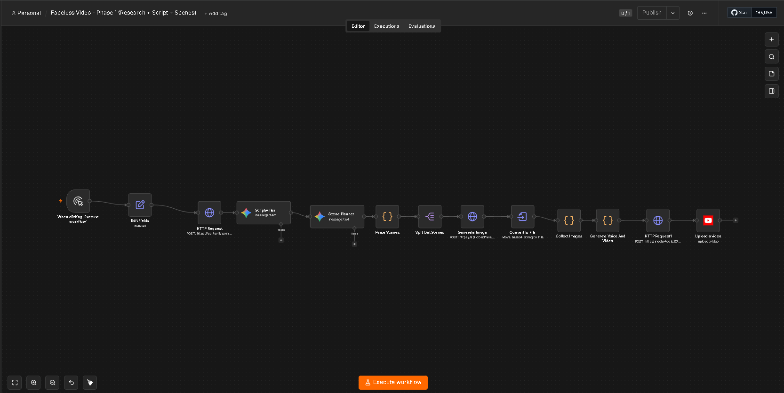

# Faceless Video Automation (n8n + AI Agents)

A fully automated pipeline that researches a topic, writes a script, generates images, creates a voiceover, assembles a video, and uploads it directly to YouTube Shorts — built entirely with **free and open-source tools**.

Given a topic (either set manually or picked automatically by an AI agent), the workflow:

1. **Researches** real facts about the topic using the Tavily Search API
2. **Writes a script** — a punchy 15-25 second narration — using Google Gemini
3. **Plans scenes** — breaks the script into 3 scenes, each with a matching image prompt
4. **Generates images** for each scene using Cloudflare Workers AI (Flux model)
5. **Generates a voiceover** using `edge-tts` (free, unlimited, no API key required)
6. **Assembles the final video** with FFmpeg — stitching images + voiceover into a vertical 1080x1920 MP4, timed to match narration
7. **Writes a YouTube description + hashtags** using Gemini
8. **Uploads the video** directly to YouTube via the YouTube Data API

## Workflow Diagram



## Architecture

```
Daily Schedule / Manual Trigger
        │
        ▼
   Topic Picker (Gemini AI Agent — picks a fresh topic)
        │
        ▼
   Edit Fields (stores topic)
        │
        ▼
   Tavily Research (real facts about the topic)
        │
        ▼
   Scriptwriter (Gemini writes narration)
        │
        ├──────────────► Description Writer (Gemini writes YouTube description + hashtags)
        │
        ▼
   Scene Planner (Gemini breaks script into 3 scenes + image prompts)
        │
        ▼
   Parse Scenes (Code node — cleans up JSON output)
        │
        ▼
   Split Out Scenes (3 items, one per scene)
        │
        ▼
   Generate Image (Cloudflare Workers AI — Flux model, one call per scene)
        │
        ▼
   Convert to File (decodes Cloudflare's base64 image response)
        │
        ▼
   Collect Images (merges 3 images back into a single item)
        │
        ▼
   Generate Voice And Video (calls the media-tools service /tts endpoint)
        │
        ▼
   Render Video (calls the media-tools service /render endpoint — FFmpeg assembly)
        │
        ▼
   Upload a video (YouTube Data API — publishes the final Short)
```

## Tech Stack (100% Free)

| Component | Tool | Notes |
|---|---|---|
| Automation engine | [n8n](https://n8n.io) | Self-hosted via Docker |
| Research | [Tavily](https://tavily.com) | Free tier API |
| Script / scene planning / descriptions | [Google Gemini](https://aistudio.google.com) | Free tier API (rate-limited to ~20 requests/day) |
| Image generation | [Cloudflare Workers AI](https://developers.cloudflare.com/workers-ai/) | Free tier, Flux Schnell model |
| Text-to-speech | [edge-tts](https://github.com/rany2/edge-tts) | Free, open-source, unlimited, no API key |
| Video assembly | [FFmpeg](https://ffmpeg.org) | Free, open-source, runs locally in Docker |
| Publishing | [YouTube Data API v3](https://developers.google.com/youtube/v3) | Free, official Google API |

## Project Structure

```
n8n/
├── docker-compose.yml          # Runs n8n + media-tools containers
├── media-tools/
│   ├── Dockerfile              # Python + FFmpeg + edge-tts container
│   └── app.py                  # FastAPI service: /tts and /render endpoints
└── workflows/
    ├── Faceless_Video_Phase1.json    # Research + script + scene planning
    └── Faceless_Video_Phase2.json    # Images + voiceover + video render + upload
```

## Setup

### 1. Prerequisites
- [Docker Desktop](https://www.docker.com/products/docker-desktop/) installed and running
- Free API accounts: [Tavily](https://tavily.com), [Google AI Studio](https://aistudio.google.com) (Gemini), [Cloudflare](https://dash.cloudflare.com)
- A [Google Cloud project](https://console.cloud.google.com) with the YouTube Data API v3 enabled and OAuth credentials configured

### 2. Run the containers

```bash
docker compose up -d --build
```

This starts:
- **n8n** on `http://localhost:5678`
- **media-tools** (internal service) on port `8000`, providing the `/tts` and `/render` endpoints used by the workflow

### 3. Import the workflow

In n8n: **Workflows → Import from File** → select the JSON files from the `workflows/` folder.

### 4. Add your credentials

Inside n8n, configure credentials for:
- Google Gemini (PaLM) API
- YouTube OAuth2 (Client ID + Secret from Google Cloud Console)

And update the Tavily API key and Cloudflare Account ID / API token directly in their respective HTTP Request nodes.

### 5. Run it

Click **Execute workflow**, or let the **Daily Schedule** trigger run it automatically once a day.

## Media-Tools API

A small FastAPI service (`media-tools/app.py`) provides two endpoints used internally by the n8n workflow:

- **`POST /tts`** — converts text to speech using edge-tts, returns an MP3 file
- **`POST /render`** — accepts an audio file + multiple images, and returns a rendered vertical MP4 using FFmpeg, with each image timed proportionally to the audio length

## Notes & Limitations

- Gemini's **free tier** is limited to roughly 20 requests/day. Since each full run makes ~4 Gemini calls (topic picking, scripting, scene planning, description writing), this comfortably supports one automated run per day — but heavy manual testing will exhaust the quota quickly.
- YouTube uploads via the API default to **Private** unless you configure the workflow to explicitly set `Public` visibility.
- This project is for educational/personal automation purposes. Always review AI-generated scripts and descriptions before publishing, especially for factual accuracy.

## License

MIT — feel free to fork and adapt.
